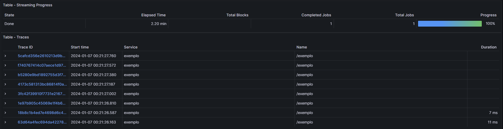
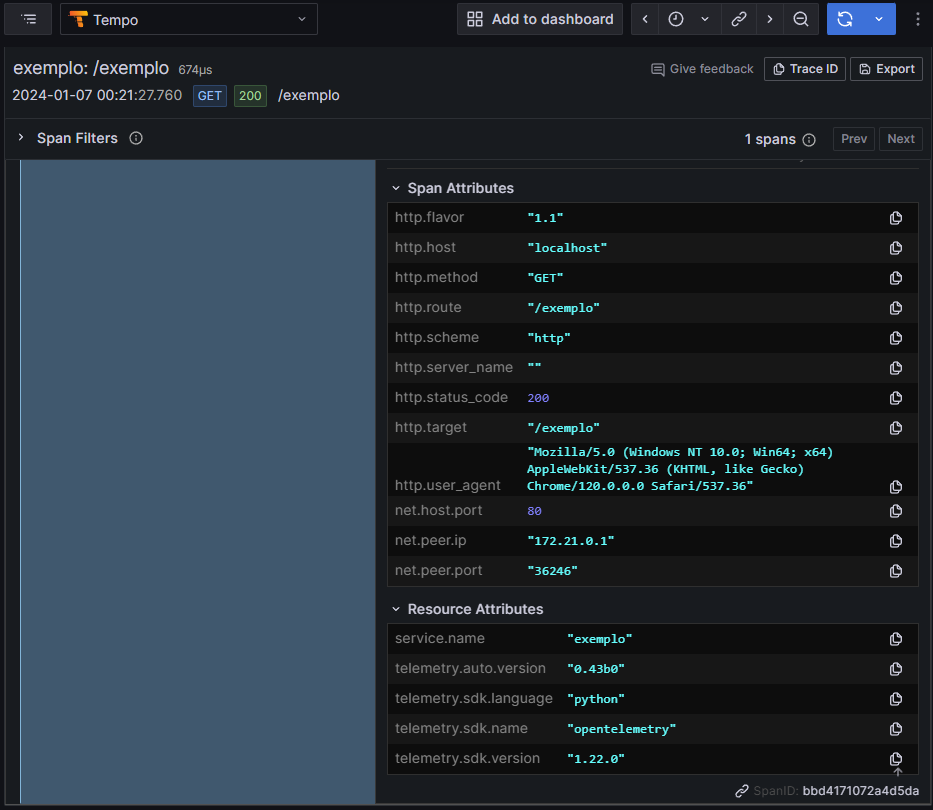

# Repositório de teste de auto instrumentação com OpenTelemetry e Python

Neste repositório a ideia é utilizar o OpenTelemetry com auto instrumentação para criar as métricas de performance, traces e logs da aplicação em Python 3. 

A nossa aplicação vai fazer o uso do Nginx + UWSGI e faremos o build da imagem para testarmos utilizando o docker. 

A documentação usada como referência: [OpenTelemetry](https://opentelemetry.io/docs/instrumentation/python/)

Temos os arquivos abaixo: 

> supervisord.conf: arquivo que executa a app, executando o binário de auto instrumentação passando como argumento a nossa app uwsgi. 

> requirements.txt: o arquivo com as bibliotecas necessárias para que nossa app funcione, ao executar o Dockerfile as bibliotecas serão instaladas na criação da imagem do container.

> Dockerfile: descritivo para criar a imagem com a nossa app e o opentelemetry. 

> app/main.py: simples rota de app em Flask 

> docker-compose.yaml: nossa stack de tracing com Grafana Tempo, Prometheus, Grafana Dashboards e App

Requisitos: 

* Docker 

* Grafana Tempo 

#### Como fazer o setup

Com o terminal, acesse o clone do repositório e execute: 

> docker build -t "opentelemetry-exemplo" .

Aguarde o build da imagem finalizar, podemos rodar o nosso container: 

> docker compose up -d 

O docker vai baixar as imagens necessárias, e executar nossa stack de app. Assim que subir os containers, faça alguns testes de acesso a url: http://localhost/exemplo 

Veremos que ao acessar o Grafana na url: http://localhost:3000, poderemos ir no botão explorer e ver nossas requests sendo gravadas no Grafana Tempo. 

#### Lista de tracings indexados

#### Visualização dos traces

